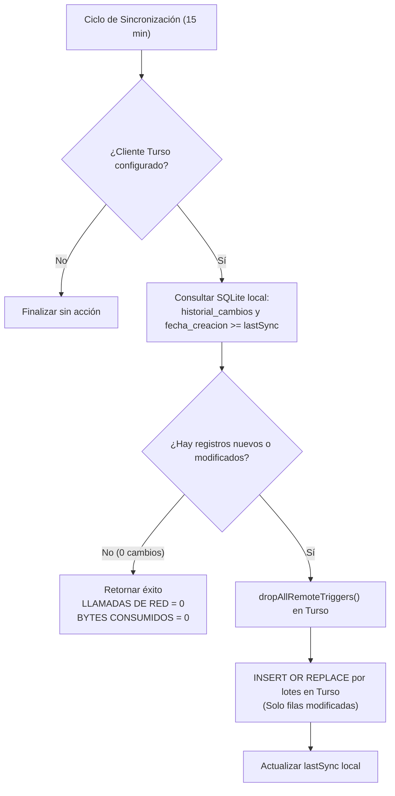

# Servicio de Sincronización Espejo con Turso Cloud (Backend API v2)

Este documento detalla la especificación técnica interna del subsistema de sincronización con Turso Cloud integrado en `@aguavp/api-server`.

---

## 1. Arquitectura del Servicio

El servicio está implementado en [`src/v2/services/tursoSyncService.js`](file:///C:/Users/ASUS/Documents/Agua_VP_Electron/api-AguaVP/src/v2/services/tursoSyncService.js) y se comunica con la réplica remota mediante el cliente oficial `@libsql/client`.

```
                    ┌──────────────────────────────────────────────┐
                    │               AguaVPServer                   │
                    │           (src/api-module.js)                │
                    └──────────────────────┬───────────────────────┘
                                           │ Inicializa en arranque
                                           ▼
┌───────────────────────┐        ┌───────────────────────────────────┐
│  Rutas /api/v2/sync   ├───────►│      tursoSyncService.js          │
│  (syncController.js)  │        │ - testConnection()                │
└───────────────────────┘        │ - configure()                     │
                                 │ - seedDatabase()                  │
                                 │ - syncIncremental()               │
                                 └─────────┬───────────────┬─────────┘
                                           │               │
                             SQLite Local  │               │ HTTP / LibSQL
                             (db-sqlite)   │               │ (@libsql/client)
                                           ▼               ▼
                                   ┌──────────────┐ ┌──────────────┐
                                   │  agua-vp.db  │ │ Turso Cloud  │
                                   │   (Maestro)  │ │  (Réplica)   │
                                   └──────────────┘ └──────────────┘
```

---

## 2. Endpoints Disponibles

Todas las rutas están montadas en `/api/v2/sync` y requieren token JWT con rol de `superadmin` o `administrador`:

| Método | Endpoint | Descripción | Body / Parámetros |
| :--- | :--- | :--- | :--- |
| `GET` | `/api/v2/sync/status` | Retorna el estado actual del servicio en memoria | Ninguno |
| `POST` | `/api/v2/sync/test` | Prueba conectividad y mide latencia hacia Turso | `{ tursoUrl, tursoToken }` |
| `POST` | `/api/v2/sync/configure`| Reconfigura parámetros en caliente sin reiniciar | `{ tursoUrl, tursoToken, autoSync, syncIntervalMs }` |
| `POST` | `/api/v2/sync/seed` | Ejecuta la carga semilla completa (esquema + datos) | Ninguno |
| `POST` | `/api/v2/sync/now` | Dispara una sincronización incremental inmediata | Ninguno |

---

## 3. Carga Semilla Inicial (`seedDatabase`)

La función `seedDatabase()` clona la estructura y todos los registros locales hacia Turso. Se ejecuta al vincular una base nueva o de forma manual desde la interfaz de administración.

### Secuencia de Ejecución:
1. **Extracción del Esquema Local:** Consulta `sqlite_master` para obtener sentencias `CREATE TABLE`, `CREATE INDEX` y `CREATE VIEW`.
2. **Creación en Turso:** Ejecuta sentencias con `IF NOT EXISTS` para tablas, índices y vistas.
3. **Limpieza de Triggers Remotos (`dropAllRemoteTriggers`):**
   * Consulta `SELECT name FROM sqlite_master WHERE type = 'trigger'` en Turso.
   * Ejecuta `DROP TRIGGER IF EXISTS` para cada trigger.
   * **Razón técnica:** En Turso no deben ejecutarse disparadores de validación de saldos (`validar_pago_contra_saldo`) ni de recálculo (`actualizar_saldo_factura`), ya que rechazarían los pagos históricos ya liquidados o alterarían los saldos reales consolidados por el SQLite local.
4. **Copia de Datos en Orden de Dependencias:**
   Las tablas se procesan en lotes de 100 registros (`tursoClient.batch`) respetando estrictamente el siguiente orden:
   ```javascript
   const TABLE_SYNC_ORDER = [
       '__drizzle_migrations',
       'apps',
       'usuarios',
       'historial_passwords',
       'refresh_tokens',
       'sesiones',
       'tokens_revocados',
       'auditoria_seguridad',
       'configuracion_servicio',
       'tarifas',
       'rangos_tarifas',
       'historial_tarifas',
       'rutas',
       'clientes',
       'medidores',
       'rutas_puntos',
       'cliente_medidor_historial',
       'lecturas',
       'facturas',
       'convenios_pago',
       'parcialidades_convenio',
       'pagos',
       'cortes_servicio',
       'historial_cambios'
   ];
   ```
5. **Actualización de Metadatos:** Actualiza `syncState.lastSync` con la fecha y hora UTC ISO.

---

## 4. Sincronización Incremental Inteligente (`syncIncremental`)

La función `syncIncremental()` se ejecuta automáticamente cada **15 minutos** (o manualmente a petición). Está diseñada bajo la política **Zero-Waste** para cuidar la cuota de **3 GB mensuales** de Turso:



### Detección Local de Cambios:
* **Actualizaciones (`UPDATE`):** Se identifican consultando `historial_cambios` local para `fecha_modificacion >= lastSync`.
* **Inserciones (`INSERT`):** Se identifican consultando las tablas operativas para `fecha_creacion >= lastSync` (`facturas`, `pagos`, `lecturas`, `clientes`, etc.).
* **Relaciones dependientes:** Si se detectan `convenios_pago` nuevos, se sincronizan sus `parcialidades_convenio`; si se detectan `rutas` nuevas, se sincronizan sus `rutas_puntos`.
* **Catálogos:** `tarifas`, `rangos_tarifas` y `configuracion_servicio` únicamente se transmiten si sufrieron modificaciones registradas en el historial.

---

## 5. Reactivación Automática de Triggers en Restauración (`ensureCoreTriggers`)

En caso de contingencia donde se descargue una base de datos desde Turso para montarla en un nuevo equipo local:

* El módulo de arranque [`src/database/sqlite-migrator.js`](file:///C:/Users/ASUS/Documents/Agua_VP_Electron/api-AguaVP/src/database/sqlite-migrator.js) ejecuta automáticamente la función `ensureCoreTriggers(db, log)` tras aplicar o verificar las migraciones.
* La función inspecciona `sqlite_master` para comprobar si existen los 8 disparadores clave:
  1. `validar_pago_contra_saldo`
  2. `validar_pago_parcialidad`
  3. `validar_tipo_pago`
  4. `actualizar_saldo_factura`
  5. `actualizar_estado_factura`
  6. `registrar_cambios_facturas`
  7. `cerrar_historial_asignacion_anterior`
  8. `registrar_historial_asignacion`
* Si alguno falta, se recrea de forma atómica e instantánea con su definición canónica antes de que el servidor acepte peticiones HTTP.

---

## 6. Resiliencia ante Desconexión

* **Errores Silenciosos en Fondo:** Si el enlace de red falla durante un ciclo de sincronización automática, el error se captura, se registra en consola como advertencia no bloqueante y el servidor local continúa respondiendo a los clientes de escritorio a velocidad normal.
* **Sin Acumulación de Bloqueos:** El flag `syncState.inProgress` previene que llamadas concurrentes se traslapen mientras una transacción de red está pendiente.
