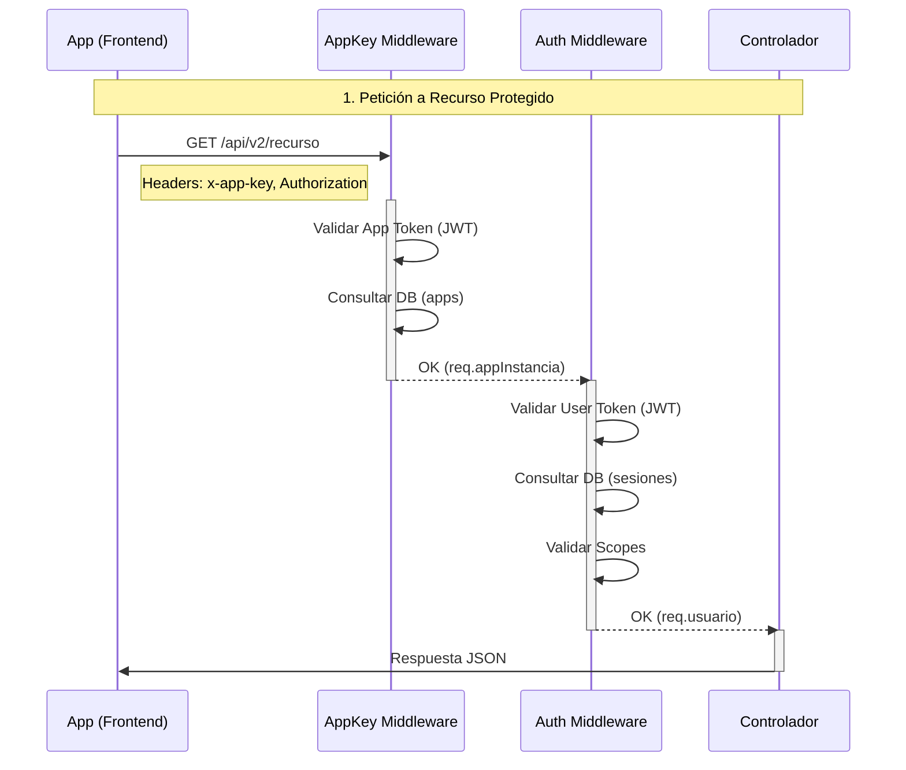

# Arquitectura de Autenticación y Autorización (Agua VP API v2)

Este documento describe el flujo completo de identidad de la API, desde el registro de la aplicación cliente hasta el acceso a recursos protegidos por parte de un usuario.

## 1. Identidad de la Aplicación (Client Identity)

Antes de que cualquier usuario pueda iniciar sesión, la **Aplicación Cliente** (Frontend, App Móvil, Integración) debe ser una entidad conocida y autorizada por el sistema.

### A. Registro de App
1.  **Endpoint**: `POST /api/v2/app/registrarApp`
2.  **Autenticación**: `x-app-key: <TOKEN_MAESTRO_INSTALACION>` (Secreto de despliegue).
3.  **Flujo**:
    *   La App envía sus metadatos (`nombre`, `scopes` requeridos).
    *   El servidor genera un `app_id` (UUID público) y un `app_token` (JWT firmado).
    *   El servidor guarda estos datos en la tabla `apps`.
4.  **Resultado**: La App recibe su `app_id` y `token` propio.

### B. Autenticación de App en Peticiones
En **TODAS** las peticiones a la API, la App debe identificarse.
1.  **Header**: `x-app-key: <APP_TOKEN>` (Formato: `AppKey <TOKEN>`).
2.  **Middleware** (`appKeyMiddleware.js`):
    *   Decodifica el JWT.
    *   Verifica que la firma sea válida (`SECRET_APP_KEY`).
    *   Busca que el `app_id` exista y esté `activo = 1` en la Base de Datos.
    *   Si es válido, inyecta `req.appInstancia` con los datos de la App.

---

## 2. Identidad del Usuario (User Authentication)

Una vez que la App es confiable, el usuario puede iniciar sesión a través de ella.

### A. Obtención de Token (OAuth 2.0 ROPC)
1.  **Endpoint**: `POST /api/v2/oauth/token`
2.  **Datos**:
    *   `grant_type`: `"password"`
    *   `username` / `password`: Credenciales del Usuario.
    *   `client_id`: ID de la App (o implícito vía `x-app-key`).
3.  **Proceso**:
    *   Valida credenciales de usuario (bcrypt).
    *   Valida credenciales de App (si aplica).
    *   **Genera Par de Tokens**:
        *   **Access Token (JWT)**: Corta duración (15 min). Vinculado a `user_id` y `app_id`.
        *   **Refresh Token**: Larga duración (7 días). Guardado en BD `refresh_tokens`.
4.  **Persistencia**:
    *   Crea registro en `sesiones` (vinculando `usuario_id` + `app_id`).

### B. Renovación de Token (Refresh Flow)
1.  **Endpoint**: `POST /api/v2/oauth/token` (`grant_type: refresh_token`).
2.  **Proceso**:
    *   Verifica si `refresh_token` existe en BD y no está revocado/expirado.
    *   Revoca el token usado (Rotation).
    *   Emite par de tokens NUEVOS.

---

## 3. Autorización (Authorization)

Control de acceso a los recursos.

### Cadena de Middlewares
Al solicitar `GET /api/v2/reports/financiero`:

1.  **`appKeyMiddleware`**:
    *   ¿Es una App válida? -> SI.
2.  **`authMiddleware`**:
    *   ¿Tiene Header `Authorization: Bearer ...`?
    *   ¿El JWT es válido y no expirado?
    *   ¿La sesión existe en BD y está activa?
    *   -> Inyecta `req.usuario` (con `scopes` extraídos del token).
3.  **Check de Scopes (Opcional por ruta)**:
    *   ¿El usuario tiene scope `read:reports`? -> SI.
4.  **Controlador**:
    *   Ejecuta la lógica de negocio.

## Resumen del Flujo de Datos

